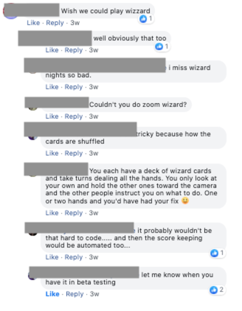
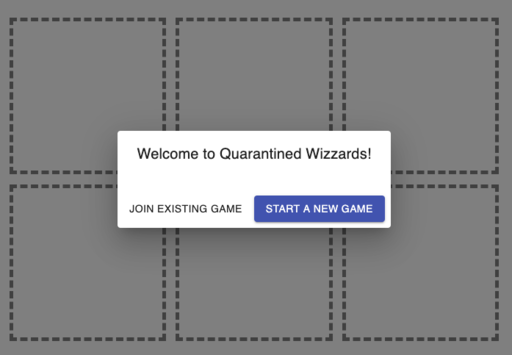
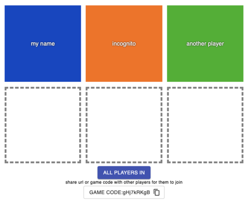
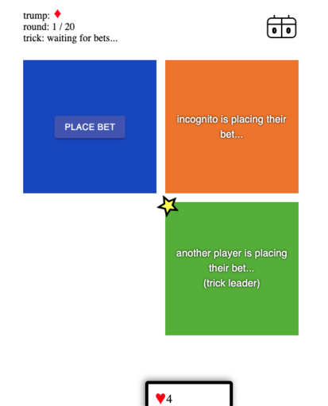
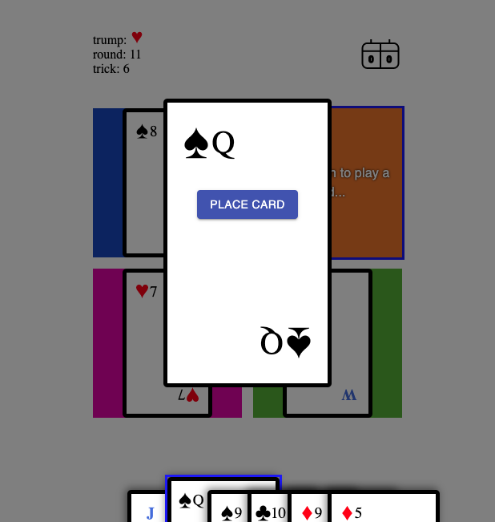

#  Quarantined Wizzards


A family favourite game brought online to support social distancing!

- [Motivation](#motivation)
- [Game Play](#game-play)
  - [Known Issues](#known-issues)
- [Getting Started (Developers)](#getting-started-developers)

## Motivation

Card parties are a regular part of life with our friends and family, but due to COVID none of us
our socializing in person these days



We decided to build an online version of one of our favorite cards games so that we could still
spend time playing together. Our family jumped on board and helped us through several rounds of
testing!


## Game Play

You will need at least 3 people to play a game. To start a new game or join an existing game go to the deployment here: https://quarantined-wizzards.herokuapp.com/

The first player starts the game and then sends the game code to the other players so that they can
join.



Once the game is created, enter your username and join. Once all the players have joined, the user
who created the game will start the game with the "All Players In" button.



The trump suit will be chosen and then it will wait for all players to make their bets. The
star icon means that this is the player that will be the trick leader



When it is your turn, click on your hand to bring up the form to place a card




### Known Issues

Occasionally the socket connection times out. When this happens you'll need to refresh your page.
If you have installed this as a progressive web app (PWA) then you can click on the scoreboard to
find a "refresh state" option which is equivalent.

## Getting Started (Developers)

This project uses [redis](https://redis.io/), [socket.io](https://socket.io/), and [React.js](https://reactjs.org/).

Before the server can be run redis should be installed and the redis server running

```bash
redis-server
```

Next build the server and start it

```bash
npm run build:server:dev
```

and

```bash
npm start
```

And then the client development server (webpack)

```bash
npm run start:dev
```

The client can now be viewed in the browser at [http://localhost:3000](http://localhost:3000).
